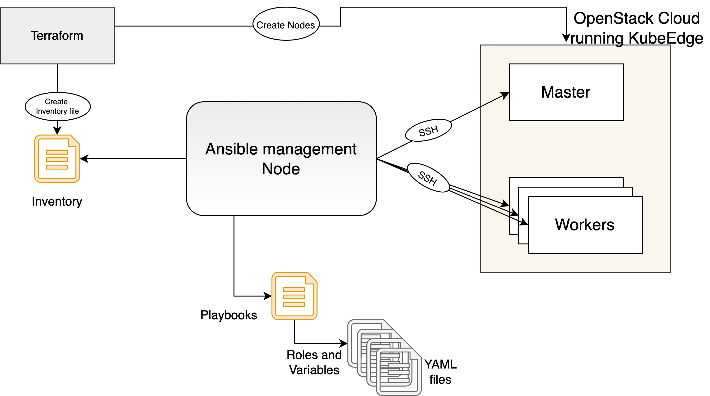

# KubeEdge-Openstack-Ansible-Automation
This is the repository for automatically deploying the [KubeEdge](https://github.com/kubeedge/kubeedge) to [OpenStack based cloud](https://www.openstack.org/) using [ansible](https://docs.ansible.com/ansible/latest/installation_guide/intro_installation.html) and [terraform](https://learn.hashicorp.com/terraform/getting-started/install.html). 


## Deployment Architecture
Overall deployment automation architecture of IoT platform : 



## Requirements

The following components are necessary for setting up and interacting with the cluster:
 * [KubeEdge](https://github.com/kubeedge/kubeedge)
 * [terraform](https://learn.hashicorp.com/terraform/getting-started/install.html)
 * [ansible](https://docs.ansible.com/ansible/latest/installation_guide/intro_installation.html)
 * [docker](https://docs.docker.com/engine/install/)

 
## Get Started

1. Clone the repository and go to the root directory:

```bash
git https://github.com/ansjin/KubeEdge-Openstack-Ansible-Automation
cd KubeEdge-Openstack-Ansible-Automation
```

2. Create a key-pair in the cloud

TODO

3. Replace the key variables in the config files accordingly

```bash
variables.tf (instance_keypair_name)
variables.tf (ssh_key_file)
ansible/ansible.cfg (private_key_file)
# all below should be equivalent to openstack_user_name
terraform.tfvars (openstack_user_name)
terraform.tfvars (openstack_tenant_name)
terraform.tfvars (openstack_project_name)
terraform.tfvars (openstack_project_id)
```

4. Download the credentials from the cloud and source it

```bash
source xxxxxxx-openrc.sh
```

5. Initialize the terraform providers

```bash
terraform init
```

6. Bootstrap the cluster

```bash
source ~/.bashrc
terraform apply -auto-approve
```

7. Destroy the cluster

```bash
terraform destroy -auto-approve
```

## Run Ansible Commands Seperately
```bash
source ~/.bashrc
cd ansible
ansible-playbook master.yml -vvvv
ansible-playbook worker.yml -vvvv
ansible-playbook master-after-join.yml -vvvv
# ansible-playbook -i cloud_hosts.ini --start-at-task "Start OpenWhisk Version of IoT Platform and create ow functions" master-after-join.yml -vvvv
```

> **_NOTE:_**  It takes about 10 min for Terraform to run + 5 min for all the Pods to be _Running_/_Completed_.